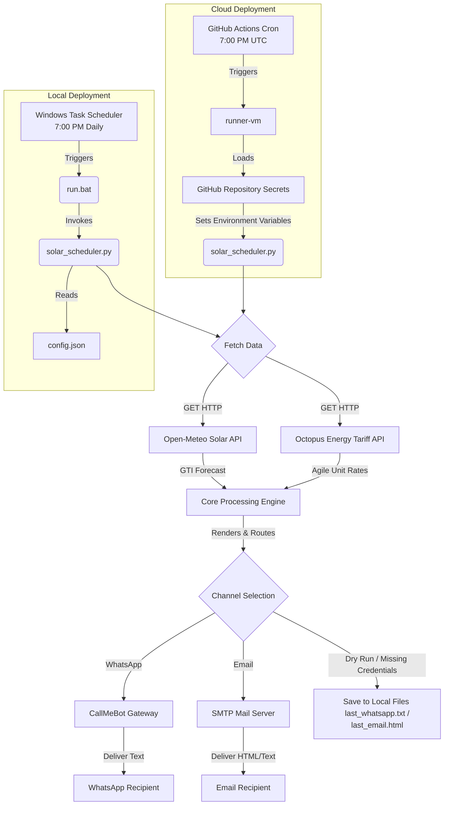

# Solar Charging & Agile Octopus Scheduler Design Approach

This document outlines the design decisions, mathematical models, and architectural framework chosen to implement the Solar Charging Scheduler and Agile Octopus Tariff Optimizer.

---

## 1. System Architecture & Deployment

The agent is designed to run in two environments:
1. **Cloud Deployment (Serverless via GitHub Actions)**: The primary deployment environment. It executes in the cloud daily at 7:00 PM UTC without local machine dependencies. Secure credentials are loaded via **GitHub Secrets**.
2. **Local Deployment (Windows Task Scheduler)**: A fallback environment running locally on a daily 7:00 PM schedule. It resolves configuration values using `config.json`.



---

## 2. Solar Estimation & Mathematical Calculations

### Panel Orientation Coordinates
For a property in Dartford, UK:
- **Latitude & Longitude**: Resolved to `51.458° N, 0.208° E`.
- **Tilt**: Default is `35°` relative to the horizontal (optimal year-round tilt in the UK).
- **Azimuth**: Open-Meteo uses the convention: `0° = South`, `90° = West`. Since the panels face South-West, the azimuth is mapped to `45°`.

### Global Tilted Irradiance (GTI)
Instead of using standard Global Horizontal Irradiance (GHI) which assumes flat panels, the agent fetches **Global Tilted Irradiance (GTI)**. The Open-Meteo API calculates this dynamically using the specified `tilt` and `azimuth` to estimate the real sunlight hitting the SW-angled panel plane.

### Optimal Battery Charging Window Algorithm
We define the window based on peak daily intensity to maximize charging efficiency:

1. **Calculate Daily Energy Density**:
   $$\text{Total Daily Energy (Wh/m}^2) = \sum_{t=0}^{23} \text{GTI}(t) \text{ W/m}^2 \times 1\text{ hour}$$
   This sum is divided by 1000 to report the day's solar potential in **$\text{kWh/m}^2$**.

2. **Compute Optimal Window**:
   - Find Peak Irradiance: $I_{\text{peak}} = \max(\text{GTI}(t))$
   - Define Threshold: $I_{\text{threshold}} = 0.5 \times I_{\text{peak}}$
   - A hour $h$ is qualified for charging if:
     $$\text{GTI}(h) \geq I_{\text{threshold}} \quad \text{and} \quad I_{\text{peak}} \geq 20 \text{ W/m}^2$$
   - The charging window begins at the minimum qualified hour $h_{\text{start}}$ and ends at $h_{\text{end}} + 1$ (representing the end of the last hourly block).

---

## 3. Agile Octopus Tariff Optimization

The agent queries the public Octopus Energy API to extract half-hourly unit rates:
- **Product Code**: `AGILE-24-10-01` (Active Agile Octopus tariff product).
- **Tariff Code**: `E-1R-AGILE-24-10-01-J` (Region `J` corresponds to GSP Group _\_J_, representing South Eastern England/Dartford).

### Time-Based Target Date Selection
To ensure the reports are relevant depending on when the script executes, the agent implements a time boundary rule:
- **BST-Aware Timezone Engine**: A custom mathematical algorithm calculates the local time in London by detecting the British Summer Time (BST) offset from UTC (last Sunday of March to last Sunday of October). This bypasses Windows/Linux system database discrepancies.
- **5:00 PM Cutoff Rule**:
  - If executed **before 5:00 PM (17:00) London time**, the target date is set to **Today**.
  - If executed **at or after 5:00 PM (17:00) London time**, the target date is set to **Tomorrow** (as tomorrow's rates are published by 4:00 PM).
  - The solar forecast calculations and the Agile Octopus rates both align to the chosen target date.

### Algorithmic Processing of Tariff Data
1. **Query Date-Filtered Window**: The agent queries rates for the target forecast date using `period_from` and `period_to` parameters.
2. **Fallback Logic**: If the API has not published rates for the requested date, it gracefully falls back to the most complete date in the API response page.
3. **Cheapest Slots Sorting**: 
   - The list of 48 half-hour slots is sorted in **ascending order** of unit price (`value_inc_vat`).
   - The **top 6 cheapest slots** are extracted.
   - These 6 slots are presented in two structures:
     - **By Price (Ascending)**: For instant comparison of the absolute cheapest slots.
     - **By Time (Chronological)**: To simplify programming home battery or appliance scheduling software.

---

## 4. UI/UX & Output Formats

### WhatsApp Text Report
To maintain a high-end mobile experience, the text is structured using WhatsApp's formatting keys:
*   **Asterisks (`*`)** for bold titles.
*   **Triple Backticks (<code>```</code>)** to enclose the hourly solar forecast and the Agile Octopus rates. This forces a monospaced font layout in WhatsApp, aligning columns perfectly like a physical table.
*   **Emojis** for rating status (☀️, ⛅, 🌧️, etc.) to allow fast cognitive scanning.

### Email (HTML)
The HTML template utilizes a slate-blue dashboard style. For the tariff section, it inserts an Agile Octopus card showing the top 6 slots with a distinct glowing gold badge highlighting the single absolute cheapest slot of the day.

---

## 5. Robustness & Cloud Portability

*   **Zero-Dependency Design**: Built using standard Python libraries (`urllib`, `smtplib`, etc.), ensuring it runs in any standard Python environment without requiring packages like `requests`.
*   **Hybrid Configuration Engine**: Reads settings from `config.json` when running locally, but overrides them with environment variables when executed in a container or pipeline. This allows repository code to remain public while secrets (API keys/credentials) are stored in secure environment vaults (like GitHub Actions Secrets).
*   **Graceful Degradation**: If an external API is down or credentials are not provided, it writes data locally to preview files (`last_whatsapp.txt` / `last_email.html`) and prints setup instructions rather than raising fatal runtime exceptions.
